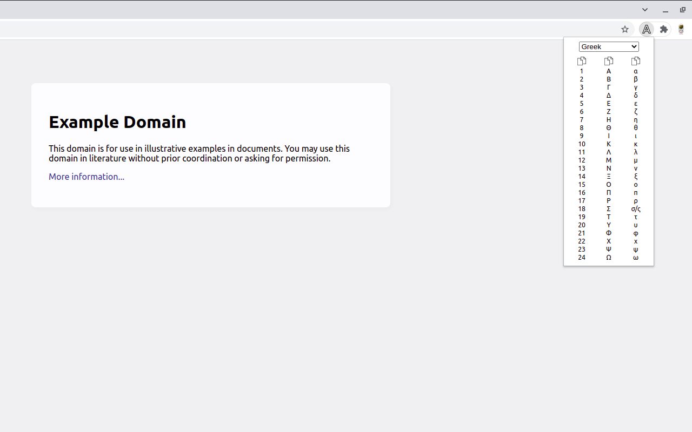

# [Alphabets](https://chrome.google.com/webstore/detail/bhpjlplbnifhpolicjigaghdchamocee)

- [Installation for developers (for Linux users)](#installation-for-developers-for-linux-users)
- [Sources](#sources)
  - [Icons](#icons)
  - [Alphabets](#alphabets)

---

---

## Installation for developers (for Linux users)

1. Go to the `chrome://extensions`.
2. Enable `Developer mode` checkbox.
3. Click on the `Load unpacked` button.
4. Select the extension directory.

---

## Sources

### Icons

- [A](https://flaticon.com/free-icon/a_3564016)
- [Copy](https://iconfinder.com/icons/172587/copy_icon)

### Alphabets

- [List of languages by the number of countries in which they are recognized as an official language](https://en.wikipedia.org/wiki/List_of_languages_by_the_number_of_countries_in_which_they_are_recognized_as_an_official_language)

---

- Belarusian
  - [Belarusian alphabet - Letters](https://en.wikipedia.org/wiki/Belarusian_alphabet#Letters)
- French
  - [French orthography - Alphabet](https://en.wikipedia.org/wiki/French_orthography#Alphabet)
- German
  - [German orthography - Alphabet](https://en.wikipedia.org/wiki/German_orthography#Alphabet)
- Greek
  - [Greek alphabet - Letters](https://en.wikipedia.org/wiki/Greek_alphabet#Letters)
- Italian
  - [Italian orthography - Alphabet](https://en.wikipedia.org/wiki/Italian_orthography#Alphabet)
- Portuguese
  - [Portuguese orthography - Letter names and pronunciations](https://en.wikipedia.org/wiki/Portuguese_orthography#Letter_names_and_pronunciations)
- Russian
  - [Russian alphabet - Letters](https://en.wikipedia.org/wiki/Russian_alphabet#Letters)
- Serbian Cyrillic
  - [Serbian Cyrillic alphabet - Modern alphabet](https://en.wikipedia.org/wiki/Serbian_Cyrillic_alphabet#Modern_alphabet)
- Spanish
  - [Spanish orthography - Alphabet in Spanish](https://en.wikipedia.org/wiki/Spanish_orthography#Alphabet_in_Spanish)
- Turkish
  - [Turkish alphabet - Letters](https://en.wikipedia.org/wiki/Turkish_alphabet#Letters)
- Ukrainian
  - [Ukrainian alphabet - Alphabet](https://en.wikipedia.org/wiki/Ukrainian_alphabet#Alphabet)
